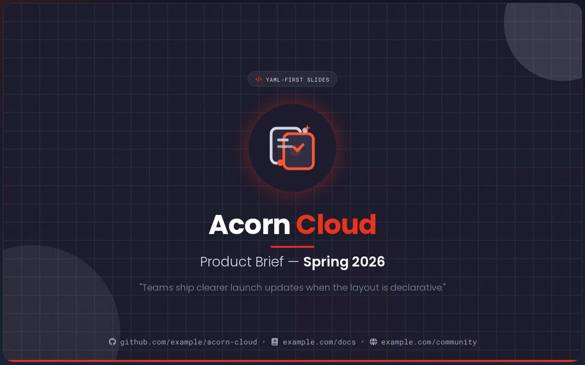

<div align="center">

# Slide Spec

**Create beautiful slides from YAML - presentations as structured data for open sharing and collaboration. Built for open source, usable everywhere.**

[](https://www.npmjs.com/package/@slide-spec/cli)
[](https://github.com/lreading/slide-spec/actions/workflows/main.yml)
[](./LICENSE)
[](https://www.bestpractices.dev/en/projects/12235/passing)

[Live Demo](https://www.slide-spec.dev) · [Docs](https://docs.slide-spec.dev) · [Example YAML](content/)



</div>


Slide Spec turns structured YAML into static slide decks you can host anywhere. Keep presentations in the same repo as your code so teams can review them in PRs, diff changes, and publish open formats without proprietary authoring tools.

- Write slides as structured YAML you can diff, lint, and review
- Build a static site you can deploy to GitHub Pages, S3, or any CDN
- Share presentations as open web output, not proprietary files
- Use validation in CI for a source-controlled workflow


## ⚡ Quickstart

Prereqs: Node 24+ and pnpm.

```sh
npx @slide-spec/cli init
npx @slide-spec/cli serve
```

Open the URL printed in your terminal. If `5173` is busy, `serve` picks another free port. You should have a working deck in under two minutes.

From there, edit the YAML under `content/`, then validate and build:

```sh
npx @slide-spec/cli validate
npx @slide-spec/cli build      # outputs to ./dist
```

Pass `--deployment-url` to `build` for canonical metadata and `sitemap.xml` generation.

Every command accepts an optional directory as its first argument (e.g. `npx @slide-spec/cli serve ./my-deck`). When omitted, the current working directory is used.


## Repository layout

pnpm workspace with package-local READMEs for development details.

| Directory | Purpose | |
|---|---|---|
| [`app/`](app/) | Vue 3 + Vite presentation renderer | [README](app/README.md) |
| [`cli/`](cli/) | Scaffold, validate, build, and serve | [README](cli/README.md) |
| [`docs/`](docs/) | VitePress documentation site | [README](docs/README.md) |
| [`shared/`](shared/) | Shared TypeScript types and validation | [README](shared/README.md) |
| [`content/`](content/) | YAML for this repo's own slide decks | |

Repo development:

```sh
pnpm install --frozen-lockfile
pnpm verify
pnpm verify:ci
```

Dependency changes:

```sh
pnpm --filter @slide-spec/app add <package>    # one package
pnpm --filter @slide-spec/app add -D <package> # one package, dev dependency
pnpm --filter '@slide-spec/*' add <package>    # all workspace packages
pnpm add -w -D <package>                       # root-only tooling
pnpm -r update <package> --latest              # update a catalog version
```

pnpm manages dependency versions through the workspace catalog. The repo also enforces a 5-day minimum release age for package versions.

Emergency security update before the 5-day wait:

1. Add an exact reviewed exception in `pnpm-workspace.yaml`: `minimumReleaseAgeExclude: ["<package>@<version>"]`.
2. Run the normal add/update command.
3. Run `pnpm verify`.


## Releases

Slide Spec follows [semver](https://semver.org). The CLI is published to npm as [`@slide-spec/cli`](https://www.npmjs.com/package/@slide-spec/cli).

> ⚠️ **v0 / alpha** - the project is pre-1.0 and minor versions may contain breaking changes without prior deprecation. Pin your version if you need stability.

Pushing a `v*` release tag triggers the release pipeline. CI runs all quality gates, publishes to npm, and attaches both a source tarball and a CycloneDX SBOM to the [GitHub release](https://github.com/lreading/slide-spec/releases).

Stable releases use signed `vX.Y.Z` tags. Prereleases use signed `vX.Y.Z-alpha`, `vX.Y.Z-beta`, or `vX.Y.Z-rc` tags and publish to matching npm dist-tags.


## Contributing

See [CONTRIBUTING.md](CONTRIBUTING.md) for how to report bugs, request features, and submit code.

Please read our [Code of Conduct](CODE_OF_CONDUCT.md) before participating.

## License

[Apache 2.0](LICENSE)
